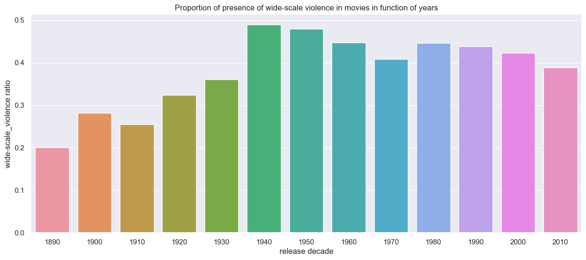
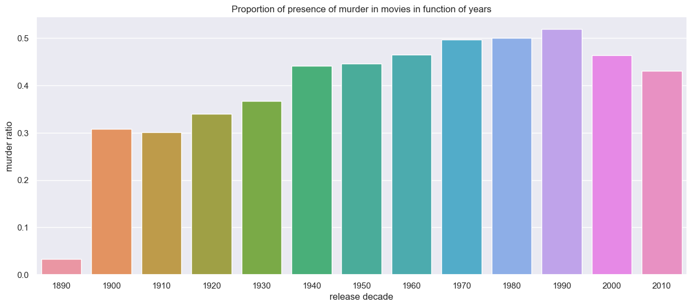
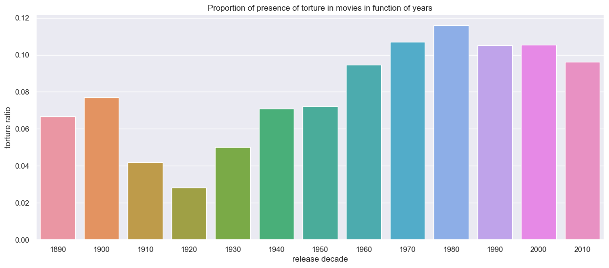
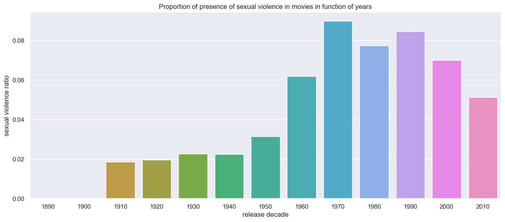

# How is violence represented in different countries and languages?

* * *

The representation of violence can be as varied as one's imagination allows because it is such a broad topic.
Its level of public acceptance of explicitness is a difficult threshold to draw for universal acclaim.
Different cultures tolerate this kind of representation to varying degrees.
Naturally, when we refer to culture, we mean people from different parts of the world as well as from diverse historical periods.
Each person's background towards violence is unique, and this background may have historical roots.
Conflicts, instability, and morality can influence people's desire to see explicit violence.

* * *

## Violence representation throughout the decades

As in the rest of our project we separate 4 different types of violence namely **"murder"**, **"torture"**, **"widescale violence"** and **"sexual violence"**.

We decide to plot the ratio of movies containing words related to the previously stated types of violence in function of release year.

et moi je vais me doucher, SALUT 
JE PEUX VENIR ?OU TU VEUX PRENDRE UNE DOUCHE FROIDE MDR
TU BOSSES TOI 
AH. 
MAIS TU PEUX 
En vrai je vais bosser encore un peu mais bonne douche 
okeeee salut ma reuf 

1. Widescale violence

1. Murder

1. Torture

1. Sexual violence

